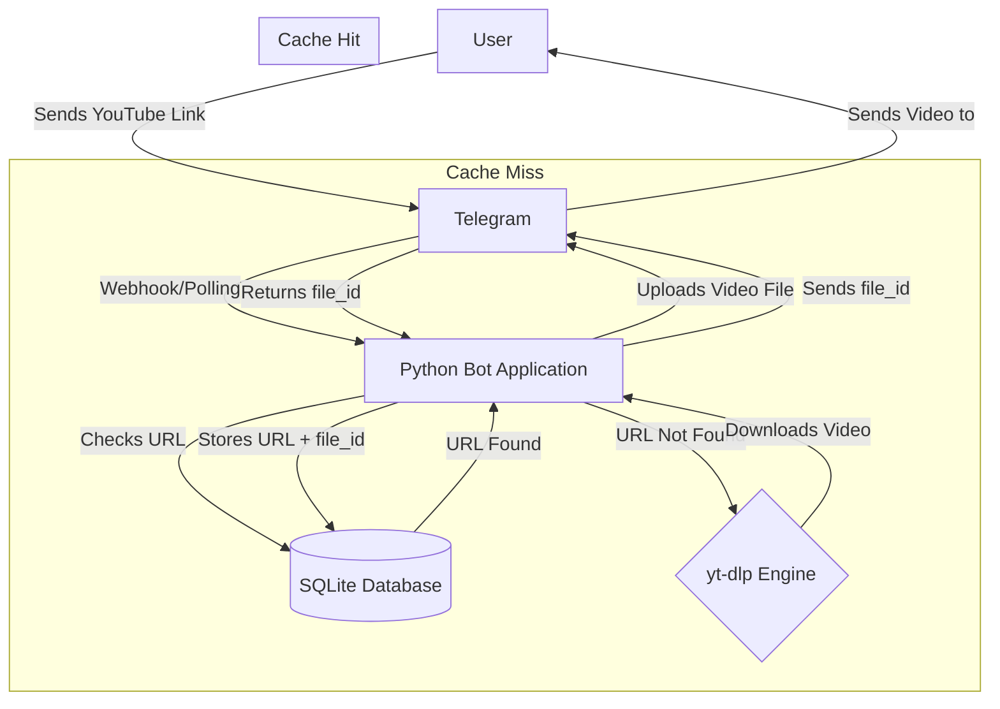
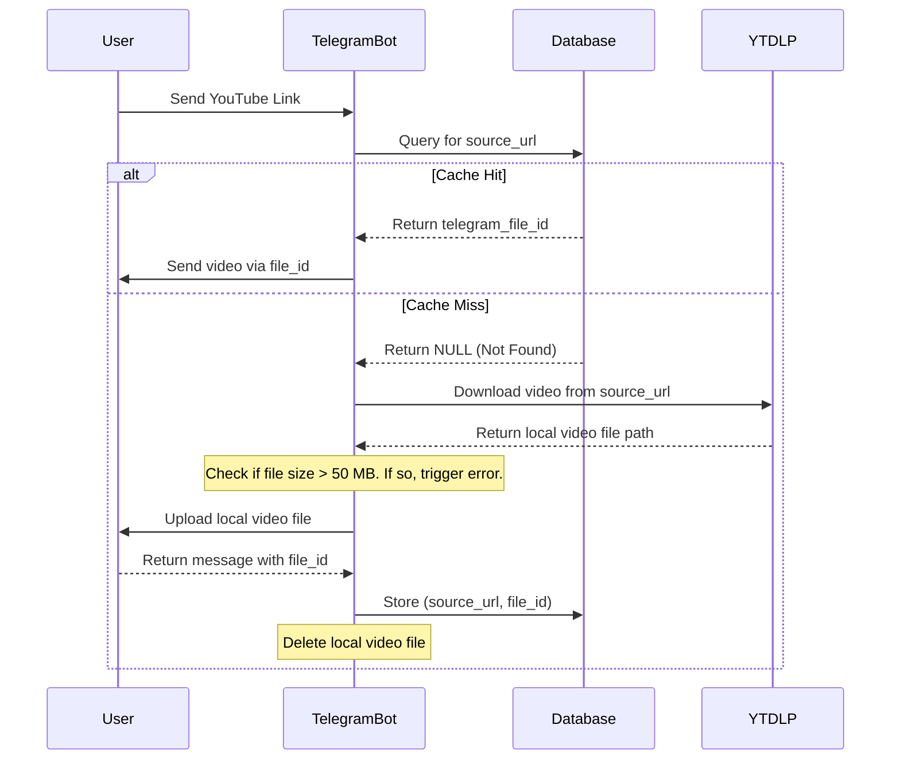

### **Document 1: Project Brief**

```markdown
# Project Brief: Telegram Video Downloader Bot

## Executive Summary

This project outlines the creation of a Telegram bot designed for downloading videos from various online platforms (starting with YouTube) by simply processing a shared link. The core problem this bot solves is twofold: for users, it provides a fast and convenient way to save videos; for the operator, it addresses the high operational costs of such a service. The key value proposition lies in an intelligent `file_id` caching strategy, which leverages Telegram's own infrastructure to serve popular videos instantly and at virtually no cost after the initial download, making the service highly efficient and scalable.

## Problem Statement

Users who wish to download videos from platforms like YouTube or TikTok often face inconvenient, ad-riddled, or potentially insecure third-party websites and apps. For developers attempting to solve this with a bot, the primary pain point is the significant and recurring cost of bandwidth and server resources. Each time a popular video is requested, it must be re-downloaded from the source and re-uploaded to Telegram, creating a slow user experience and an unsustainable cost model that scales linearly with usage.

## Proposed Solution

The proposed solution is a Python-based Telegram bot that acts as an intelligent orchestrator for the open-source download engine `yt-dlp`. The bot's key innovation is its caching mechanism.

*   **Path 1 (Cache Miss):** On receiving a new video link for the first time, the bot downloads the video, uploads it to the user, and critically, saves the returned Telegram `file_id` to a database, mapping it to the original URL. The local file is then deleted.
*   **Path 2 (Cache Hit):** For all subsequent requests for the same URL, the bot retrieves the `file_id` from its database and instructs Telegram to send the file directly. This bypasses any use of our server's resources, resulting in an instant and free delivery for the user and operator.

## Target Users

*   **Primary User Segment:** General Telegram users who want a quick, reliable way to save videos for offline viewing, sharing across platforms, or for archival purposes.
*   **Secondary User Segment:** Content creators and community managers who need to efficiently download videos for use in their own content or channels.

## Goals & Success Metrics

### Business Objectives
*   Minimize operational costs to be sustainable on a free-tier hosting plan (e.g., Railway).
*   Achieve a high cache-hit ratio to validate the efficiency of the core architecture.
*   Build a functional MVP quickly to test the core hypothesis and gather user feedback.

### User Success Metrics
*   **Speed:** Cached video delivery should be near-instantaneous (< 2 seconds).
*   **Reliability:** A high percentage of valid, public video links should be processed successfully.
*   **Ease of Use:** The user interaction should be limited to simply sending a link.

### Key Performance Indicators (KPIs)
*   **Cache Hit Rate:** (Number of Cache Hits / Total Requests). Target: > 80%.
*   **Monthly Active Users (MAU):** To measure adoption and growth.
*   **Average Response Time:** Measured separately for cache hits vs. misses to quantify performance gains.
*   **Download Success/Failure Rate:** To monitor the reliability of `yt-dlp`.

## MVP Scope

### Core Features (Must Have)
*   Bot accepts and processes video links from a single platform: **YouTube**.
*   Full implementation of the `file_id` caching logic (both "Cache Miss" and "Cache Hit" paths).
*   A simple database (SQLite) for storing the URL-to-`file_id` mapping.
*   Graceful handling of successful downloads (sending the video file back to the user).
*   Basic error handling for failed downloads (e.g., "Sorry, I couldn't download this video.").

### Out of Scope for MVP
*   Support for other platforms (TikTok, Instagram, Pinterest, etc.).
*   A job queue system for handling concurrent downloads.
*   User-facing analytics or download history.
*   Format or quality selection (e.g., audio-only, 1080p vs 720p).
*   Support for downloading entire playlists or channels.

## Post-MVP Vision

*   **Phase 2:** Introduce support for a second high-demand platform (e.g., TikTok). Implement a job queue (e.g., Celery with Redis) to handle concurrent requests efficiently. Upgrade the database to PostgreSQL for better scalability.
*   **Long-term Vision:** Expand platform support, introduce features like format/quality selection, and potentially build a simple analytics dashboard to track popular videos and bot usage statistics.

## Technical Considerations

*   **Platform Requirements:** The bot must be deployable on a platform-as-a-service (PaaS) like Railway, operating within its free-tier limits for the MVP.
*   **Technology Preferences:**
    *   **Language:** Python
    *   **Telegram Bot Library:** `python-telegram-bot` or `aiogram`
    *   **Downloading Engine:** `yt-dlp` (as a Python library)
    *   **Database:** SQLite for MVP, with a clear path to migrate to PostgreSQL.
*   **Architecture Considerations:** The architecture is fundamentally cache-first. The MVP will be a single, monolithic process. Future versions will evolve into a multi-process architecture with a main bot process, a job queue, and one or more worker processes.

## Constraints & Assumptions

*   **Constraints:**
    *   The project will initially be constrained by the resource limits of a free-tier hosting plan.
    *   The bot must operate within Telegram's API limits (e.g., file size limits, message rate limits).
    *   The bot's operation is dependent on the continued functionality of the `yt-dlp` project.
*   **Key Assumptions:**
    *   Telegram's `file_id` system will remain a stable, long-term feature.
    *   The cache hit rate will be high enough to make the service cost-effective.

## Risks & Open Questions

*   **Key Risks:**
    *   **Technical Risk:** `yt-dlp` may temporarily break when source websites update their structure. This requires a strategy for frequent updates.
    *   **Platform Risk:** The bot's functionality is against the Terms of Service of the source platforms.
    *   **Resource Risk:** A sudden influx of unique, "cache miss" requests could overwhelm the free-tier server resources.
*   **Open Questions:**
    *   What is the most efficient database schema for this task?
    *   What is the best strategy for updating the `yt-dlp` dependency with minimal downtime?
    *   How should the bot handle videos that exceed Telegram's file size limits?
```

---

### **Document 2: Product Requirements Document (PRD)**

```markdown
# Telegram Video Downloader Bot Product Requirements Document (PRD)

## Goals and Background Context

### Goals
*   To create a Telegram bot that allows users to download videos from YouTube by sending a link.
*   To implement a `file_id` caching system to minimize server costs and provide instant delivery for popular videos.
*   To build a functional MVP that operates within the limits of a free-tier hosting plan (e.g., Railway).
*   To establish a foundation that can be expanded to support more platforms and features in the future.

### Background Context
This project aims to solve the common user need of downloading online videos in a simple, secure, and ad-free manner. The primary technical challenge for such a service is the operational cost associated with bandwidth and processing.

Our core strategy is to use Telegram's own infrastructure as a free, distributed cache. When a video is requested for the first time, our bot will download it using `yt-dlp`, send it to the user, and store the `file_id` provided by Telegram in our database. All subsequent requests for that same video will be fulfilled instantly by sending this `file_id`, eliminating any load on our server. This makes the service exceptionally fast for users and cost-effective to operate.

### Change Log
| Date       | Version | Description              | Author |
| :--------- | :------ | :----------------------- | :----- |
| [Current Date] | 1.0     | Initial PRD draft.       | John   |

## Requirements

### Functional
1.  **FR1:** The bot MUST accept and correctly parse valid YouTube video URLs.
2.  **FR2:** The bot MUST implement a "cache miss" workflow: if a URL is not in the database, it shall download the video, upload it to Telegram, and store the resulting `file_id` mapped to the URL.
3.  **FR3:** The bot MUST implement a "cache hit" workflow: if a URL is found in the database, it shall send the video to the user using the stored `file_id`.
4.  **FR4:** The bot MUST respond to a `/start` command with a brief, welcoming message explaining its function.
5.  **FR5:** The bot MUST send the video file to the user upon a successful download.
6.  **FR6:** The bot MUST send a user-friendly error message if a video download fails for any reason (e.g., private video, invalid link).

### Non Functional
1.  **NFR1:** The service MUST be deployable and operable within the resource constraints of Railway's free tier for the MVP.
2.  **NFR2:** Responses for "cache hit" requests SHOULD be delivered to the user in under 2 seconds.
3.  **NFR3:** The database for the MVP WILL be SQLite.
4.  **NFR4:** The system MUST handle videos up to Telegram's bot upload limit of 50 MB and provide a clear error for files exceeding this limit.
5.  **NFR5:** Basic operational events (request received, cache hit/miss, success/failure) MUST be logged for debugging purposes.

## User Interface Design Goals
This project is a service-based bot and does not have a graphical user interface (GUI). This section is not applicable.

## Technical Assumptions
*   **Repository Structure:** Single Repository.
*   **Service Architecture:** A single, monolithic Python process for the MVP.
*   **Testing Requirements:** Unit tests will be created for core logic, including URL parsing, database interaction, and the caching decision logic.
*   **Additional Technical Assumptions:** The bot will be built using Python, leveraging the `python-telegram-bot` (or `aiogram`) and `yt-dlp` libraries.

## Epic List
*   **Epic 1: MVP - YouTube Video Downloader with Caching:** Establish the core bot functionality, including receiving links, implementing the complete cache-miss and cache-hit logic for YouTube, and handling basic user interactions and errors.

## Epic 1: MVP - YouTube Video Downloader with Caching
This epic covers all work required to launch a functional, efficient bot that can handle YouTube links. The goal is to successfully implement the `file_id` caching architecture and provide a reliable service for the initial user base.

### Story 1.1: Bot Setup and Welcome
*As a user, I want to start the bot and receive a welcome message, so that I know it's active and understand how to use it.*

**Acceptance Criteria:**
1.  The bot successfully connects to the Telegram API using its token.
2.  When a user sends the `/start` command, the bot replies with a simple, informative welcome message.
3.  The welcome message briefly explains that the user should send a YouTube link.

### Story 1.2: Implement Cache Miss Logic
*As the system, I want to process a new, unique YouTube link by downloading the video and storing its `file_id`, so that it can be cached for future requests.*

**Acceptance Criteria:**
1.  When a new YouTube URL is received, the system correctly identifies it is not in the database.
2.  The system uses `yt-dlp` to download the corresponding video file to the server's temporary storage.
3.  The system successfully uploads the video file to the user via the Telegram API.
4.  The system correctly captures the `file_id` from the successful upload response.
5.  The system saves the URL and its corresponding `file_id` into the SQLite database.
6.  The temporary video file is deleted from the server after the process is complete.

### Story 1.3: Implement Cache Hit Logic
*As the system, I want to process a previously seen YouTube link by using its stored `file_id`, so that the video is delivered instantly and efficiently.*

**Acceptance Criteria:**
1.  When a previously seen YouTube URL is received, the system correctly finds its corresponding `file_id` in the database.
2.  The system sends the video to the user by passing the `file_id` directly to the Telegram API.
3.  The video is delivered without being re-downloaded or stored on our server.

### Story 1.4: Link Processing and Orchestration
*As a user, I want to send any valid YouTube link to the bot, so that it is automatically processed using the correct caching logic.*

**Acceptance Criteria:**
1.  The bot correctly identifies and extracts YouTube URLs from user messages.
2.  The bot queries the database to determine if the URL is a "cache miss" or "cache hit".
3.  The bot correctly triggers the "cache miss" workflow (Story 1.2) for new URLs.
4.  The bot correctly triggers the "cache hit" workflow (Story 1.3) for existing URLs.
5.  The bot ignores any text that is not a valid YouTube URL.

### Story 1.5: Basic Error Handling
*As a user, I want to receive a clear message if my video can't be downloaded, so that I understand there was a problem.*

**Acceptance Criteria:**
1.  If `yt-dlp` fails to download a video (e.g., it's private, region-locked), the bot sends a specific error message to the user.
2.  If a downloaded video exceeds the 50 MB Telegram upload limit, the bot sends an error message explaining the issue.
3.  The bot does not crash or hang if a download fails.

## Checklist Results Report
This section will be populated by the Product Owner (PO) upon validation of this PRD against the master checklist.

## Next Steps

### UX Expert Prompt
This project does not require a UX Expert as it has no GUI.

### Architect Prompt
"Winston, please review this PRD. Your task is to create a detailed Architecture Document that outlines the technical design for this Telegram bot. Please focus on:
1.  The final database schema for the SQLite table.
2.  A clear diagram of the application flow, including the cache-hit/miss logic.
3.  The proposed Python project structure.
4.  A strategy for managing dependencies, especially for keeping `yt-dlp` updated.
5.  An error handling strategy that covers the scenarios in Story 1.5."
```

---

### **Document 3: Architecture Document**

```markdown
# Telegram Video Downloader Architecture Document

## Introduction
This document outlines the technical architecture for the Telegram Video Downloader Bot, as specified in the PRD. It serves as the guiding blueprint for AI-driven development, ensuring the implementation is efficient, robust, and aligns with the project's goals. The central pattern is a `file_id` caching mechanism to minimize operational costs and maximize performance.

### Change Log
| Date       | Version | Description                  | Author  |
| :--------- | :------ | :--------------------------- | :------ |
| [Current Date] | 1.0     | Initial architecture draft.  | Winston |

## High-Level Architecture

### Technical Summary
The system will be a monolithic Python application running as a single process for the MVP. It will interact with the Telegram Bot API to receive messages and send video files. The core logic involves using the `yt-dlp` library to download videos from YouTube. A local SQLite database will be used to persist a mapping of source video URLs to their corresponding Telegram `file_id`, forming our primary caching layer.

### High-Level Project Diagram


### Architectural Patterns
*   **Remote Caching via `file_id`:** The core pattern of this architecture. We offload storage and delivery of media to Telegram's servers, treating them as a free, unlimited Content Delivery Network (CDN).
*   **Singleton Process (MVP):** For the initial version, the bot will run as a single, asynchronous process. This simplifies deployment and is sufficient for initial load. Future versions will evolve to a Job Queue pattern for concurrency.

## Tech Stack
| Category         | Technology            | Version/Spec | Purpose & Rationale                                       |
| :--------------- | :-------------------- | :----------- | :-------------------------------------------------------- |
| **Language**     | Python                | 3.11+        | Mature ecosystem, excellent libraries for this task.      |
| **Bot Framework**| `python-telegram-bot` | 20.x         | Robust, well-documented, and handles async operations well. |
| **Downloader**   | `yt-dlp`              | Latest       | The industry-standard library for video downloading.      |
| **Database**     | `sqlite3`             | (built-in)   | Zero-setup, file-based DB perfect for the MVP.            |

## Database Schema
A single table is required to manage the cache. The schema is designed to be simple and efficient for our primary lookup query.

```sql
-- DDL for the video cache table in SQLite
CREATE TABLE IF NOT EXISTS video_cache (
    id INTEGER PRIMARY KEY AUTOINCREMENT,
    source_url TEXT NOT NULL UNIQUE,
    telegram_file_id TEXT NOT NULL,
    platform TEXT NOT NULL, -- e.g., 'youtube'
    created_at TIMESTAMP DEFAULT CURRENT_TIMESTAMP
);

-- Index to ensure fast lookups by URL
CREATE INDEX IF NOT EXISTS idx_source_url ON video_cache (source_url);
```

## Source Tree
The project will follow a standard Python application structure to ensure clarity and separation of concerns.

```plaintext
telegram-video-bot/
├── .env                  # Stores the Telegram Bot Token
├── requirements.txt      # Project dependencies (e.g., python-telegram-bot, yt-dlp)
├── bot.py                # Main application entry point, initializes the bot
├── config.py             # Handles loading configuration from .env
├── database.py           # All SQLite database interactions (CRUD functions)
├── downloader.py         # A wrapper for all yt-dlp functionality
└── handlers.py           # Contains the logic for handling Telegram commands and messages
```

## Core Workflows
This sequence diagram details the two primary paths: a cache hit and a cache miss.



## Error Handling Strategy
As per Story 1.5, the bot must handle download and upload failures gracefully.

1.  **Download Failures:** The main logic in `handlers.py` will wrap the call to the `downloader.py` module in a `try...except` block.
    *   It will specifically catch `yt_dlp.utils.DownloadError`.
    *   Upon catching this exception, it will log the error for debugging and send the user a message like: "Sorry, I couldn't download this video. It might be private, region-locked, or the link is invalid."
2.  **File Size Limit:** After a successful download by `yt-dlp` but *before* uploading to Telegram, the code will check the local file's size.
    *   If `file_size > 50 * 1024 * 1024` (50 MB), it will immediately delete the local file.
    *   It will then send a message to the user: "Sorry, this video is larger than 50 MB and cannot be sent via Telegram."

## Coding Standards & Implementation Guidance

*   **Dependency Management:** All dependencies will be listed in `requirements.txt`.
*   **`yt-dlp` Update Strategy:** The `yt-dlp` library will be pinned to a specific version in `requirements.txt`. It should be updated manually on a regular basis (e.g., weekly) by running `pip install --upgrade yt-dlp`, performing a quick test, and committing the new version to `requirements.txt`. This prevents unexpected breakages while ensuring we stay current with fixes.
*   **Separation of Concerns:**
    *   All bot command/message handling logic must be in `handlers.py`.
    *   All database logic (SQL queries) must be in `database.py`.
    *   All video downloading logic must be in `downloader.py`.
    *   The main `bot.py` file should only be responsible for initialization and startup.
*   **Security:** The Telegram Bot Token must be loaded from the `.env` file via `config.py` and must **never** be hardcoded in the source code.
