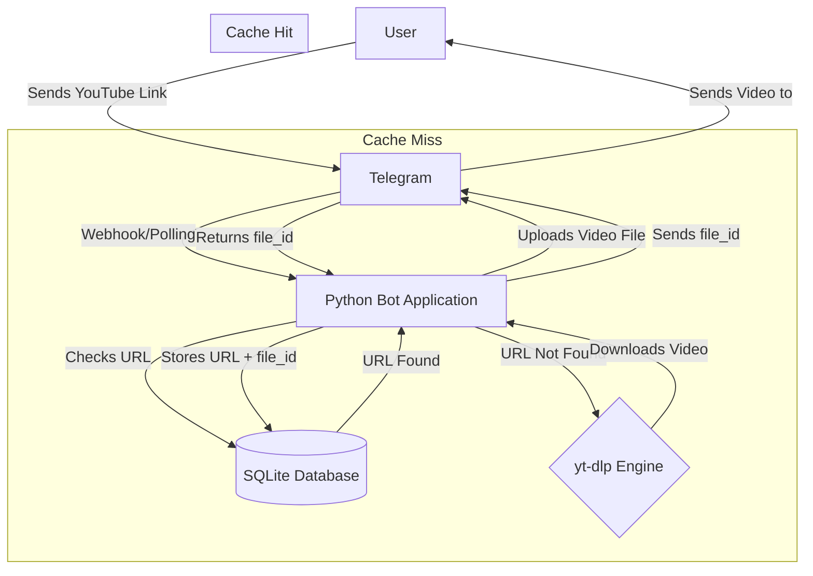
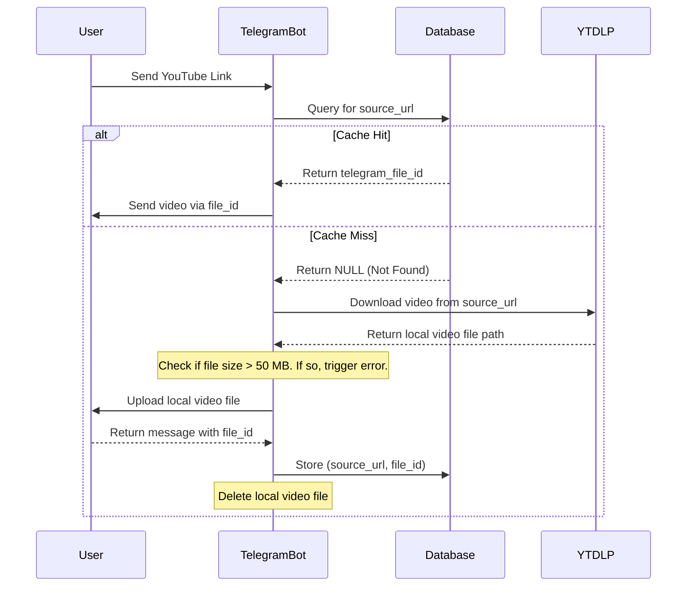

# Telegram Video Downloader Architecture Document

## Introduction
This document outlines the technical architecture for the Telegram Video Downloader Bot, as specified in the PRD. It serves as the guiding blueprint for AI-driven development, ensuring the implementation is efficient, robust, and aligns with the project's goals. The central pattern is a `file_id` caching mechanism to minimize operational costs and maximize performance.

### Change Log
| Date       | Version | Description                  | Author  |
| :--------- | :------ | :--------------------------- | :------ |
| [Current Date] | 1.0     | Initial architecture draft.  | Winston |

## High-Level Architecture

### Technical Summary
The system will be a monolithic Python application running as a single process for the MVP. It will interact with the Telegram Bot API to receive messages and send video files. The core logic involves using the `yt-dlp` library to download videos from YouTube. A local SQLite database will be used to persist a mapping of source video URLs to their corresponding Telegram `file_id`, forming our primary caching layer.

### High-Level Project Diagram


### Architectural Patterns
*   **Remote Caching via `file_id`:** The core pattern of this architecture. We offload storage and delivery of media to Telegram's servers, treating them as a free, unlimited Content Delivery Network (CDN).
*   **Singleton Process (MVP):** For the initial version, the bot will run as a single, asynchronous process. This simplifies deployment and is sufficient for initial load. Future versions will evolve to a Job Queue pattern for concurrency.

## Tech Stack
| Category         | Technology            | Version/Spec | Purpose & Rationale                                       |
| :--------------- | :-------------------- | :----------- | :-------------------------------------------------------- |
| **Language**     | Python                | 3.11+        | Mature ecosystem, excellent libraries for this task.      |
| **Bot Framework**| `python-telegram-bot` | 20.x         | Robust, well-documented, and handles async operations well. |
| **Downloader**   | `yt-dlp`              | Latest       | The industry-standard library for video downloading.      |
| **Database**     | `sqlite3`             | (built-in)   | Zero-setup, file-based DB perfect for the MVP.            |

## Database Schema
A single table is required to manage the cache. The schema is designed to be simple and efficient for our primary lookup query.

```sql
-- DDL for the video cache table in SQLite
CREATE TABLE IF NOT EXISTS video_cache (
    id INTEGER PRIMARY KEY AUTOINCREMENT,
    source_url TEXT NOT NULL UNIQUE,
    telegram_file_id TEXT NOT NULL,
    platform TEXT NOT NULL, -- e.g., 'youtube'
    created_at TIMESTAMP DEFAULT CURRENT_TIMESTAMP
);

-- Index to ensure fast lookups by URL
CREATE INDEX IF NOT EXISTS idx_source_url ON video_cache (source_url);
```

## Source Tree
The project will follow a standard Python application structure to ensure clarity and separation of concerns.

```plaintext
telegram-video-bot/
├── .env                  # Stores the Telegram Bot Token
├── requirements.txt      # Project dependencies (e.g., python-telegram-bot, yt-dlp)
├── bot.py                # Main application entry point, initializes the bot
├── config.py             # Handles loading configuration from .env
├── database.py           # All SQLite database interactions (CRUD functions)
├── downloader.py         # A wrapper for all yt-dlp functionality
└── handlers.py           # Contains the logic for handling Telegram commands and messages
```

## Core Workflows
This sequence diagram details the two primary paths: a cache hit and a cache miss.



## Error Handling Strategy
As per Story 1.5, the bot must handle download and upload failures gracefully.

1.  **Download Failures:** The main logic in `handlers.py` will wrap the call to the `downloader.py` module in a `try...except` block.
    *   It will specifically catch `yt_dlp.utils.DownloadError`.
    *   Upon catching this exception, it will log the error for debugging and send the user a message like: "Sorry, I couldn't download this video. It might be private, region-locked, or the link is invalid."
2.  **File Size Limit:** After a successful download by `yt-dlp` but *before* uploading to Telegram, the code will check the local file's size.
    *   If `file_size > 50 * 1024 * 1024` (50 MB), it will immediately delete the local file.
    *   It will then send a message to the user: "Sorry, this video is larger than 50 MB and cannot be sent via Telegram."

## Coding Standards & Implementation Guidance

*   **Dependency Management:** All dependencies will be listed in `requirements.txt`.
*   **`yt-dlp` Update Strategy:** The `yt-dlp` library will be pinned to a specific version in `requirements.txt`. It should be updated manually on a regular basis (e.g., weekly) by running `pip install --upgrade yt-dlp`, performing a quick test, and committing the new version to `requirements.txt`. This prevents unexpected breakages while ensuring we stay current with fixes.
*   **Separation of Concerns:**
    *   All bot command/message handling logic must be in `handlers.py`.
    *   All database logic (SQL queries) must be in `database.py`.
    *   All video downloading logic must be in `downloader.py`.
    *   The main `bot.py` file should only be responsible for initialization and startup.
*   **Security:** The Telegram Bot Token must be loaded from the `.env` file via `config.py` and must **never** be hardcoded in the source code.